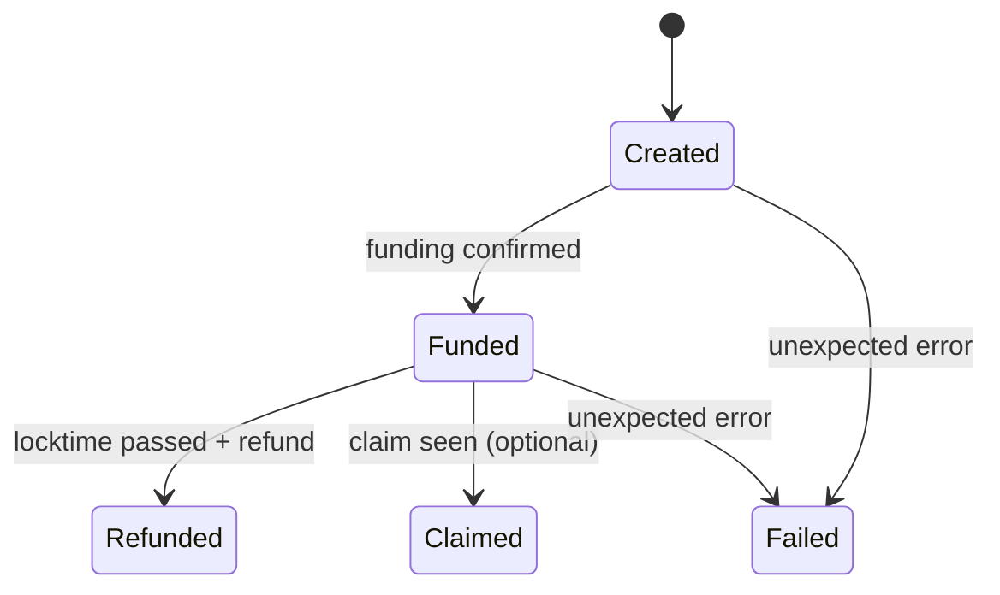

# Design: LN→Liquid Swap（P2WSH HTLC / OP_SHA256 + CLTV）

本書は「買い手が Lightning Network（LN）で支払うと、Liquid のアセットを受け取れる」最小構成の設計である。
Lightning 側は `ldk-server`、Liquid 側は LWK（`lwk_wollet`）を使う。

この設計は **完全な原子性**を提供しない。
ただし「LN 支払いの成功で preimage を得られる」ことと「preimage で Liquid HTLC を解ける」ことを結合し、実務上の “ほぼアトミック” を成立させる。

## Security & Architectural Constraints

- Liquid 側のロックは **P2WSH の HTLC** としなければならない（MUST）。
- HTLC はハッシュロックに `OP_SHA256`、タイムロックに `OP_CHECKLOCKTIMEVERIFY`（CLTV）を使わなければならない（MUST）。
  - 理由: Simplicity なしで構築でき、監査可能な最小スクリプトであるため。
- 買い手は **Liquid の HTLC が十分に fund されたこと**を検証してから LN 支払いを実行しなければならない（MUST）。
- 買い手は **HTLC に埋め込まれた hash が invoice の payment hash と一致すること**を検証してから LN 支払いを実行しなければならない（MUST）。
  - 理由: 売り手の未 fund または不一致なロックに対して先払いしないため。
- 買い手は **過払い防止のために `max_total_price_msat` を指定**しなければならない（MUST）。
  - 理由: `GetOffer` と `CreateSwap` の間に seller が価格を変更した場合でも、想定外の支払いを防ぐため。
- 売り手は `max_total_price_msat` を超える場合、`CreateSwap` を拒否しなければならない（MUST）。
- 売り手は HTLC funding transaction をブロードキャストしなければならない（MUST）。
- 売り手は、買い手に invoice を提示する前に、`min_funding_confs` を満たすまで待たなければならない（MUST）。
  - 理由: 0 conf では二重支払い・置換により HTLC が成立しない可能性があるため。
- HTLC の claim パスは **買い手の鍵による署名**を要求しなければならない（MUST）。
  - 理由: LN の経路上ノードが preimage を知り得るため、preimage 単体で spend 可能にしてはならない。
- HTLC の refund パスは **売り手の鍵による署名**と、`refund_lock_height` による CLTV を要求しなければならない（MUST）。
  - 理由: 買い手が claim しない場合に在庫を回収し、かつ早期回収できないようにするため。
- 最小構成では、HTLC outputs は **explicit（unblinded）** としなければならない（MUST）。
  - 理由: HTLC output は通常の wallet descriptor に属さず、blinding factor を永続化しないと refund/claim が実装困難になるため。
- Claim/refund を自己完結させるため、HTLC には **アセット output と LBTC の fee subsidy output** を同一条件でロックしなければならない（MUST）。
  - 理由: Liquid では手数料を LBTC で支払う必要があり、買い手に別途 LBTC を要求しないため。
- swap の状態（invoice、payment hash、funding outpoint、lock height など）は永続化しなければならない（MUST）。
  - 理由: 売り手プロセスの再起動後も refund を実行可能にするため。
- Integration Test は mock を使ってはならない（MUST NOT）。
  - 理由: `ldk-server` と Liquid regtest をまたぐ境界は mock では壊れやすいため。

## Terms

- `Seller`: swap の売り手である。Liquid のアセット在庫を持ち、`ldk-server` で invoice を発行する。
- `Buyer`: swap の買い手である。LN で支払い、Liquid でアセットを受け取る。
- `preimage (S)`: LN 支払いが成功したときに買い手が得る 32 bytes の値である。
- `payment hash (H)`: `H = SHA256(S)` で定義する 32 bytes の値である。BOLT11 invoice に含まれる。
- `HTLC`: hashlock（`H`）と timelock（CLTV）を持つ Liquid の P2WSH output である。
- `funding tx`: 売り手がアセット（と LBTC）を HTLC output に送る transaction である。
- `claim tx`: 買い手が `S` で HTLC を spend して受領先に送る transaction である。
- `refund tx`: `refund_lock_height` 以降に売り手が HTLC を spend して在庫を回収する transaction である。
- `refund_lock_height`: refund tx が有効になる Liquid の block height である。
- `min_funding_confs`: 買い手が LN 支払いを実行する前に要求する funding tx の confirmations である。
- `fee_subsidy_sats`: claim/refund tx の手数料原資として HTLC にロックする LBTC の satoshi 量である。
- `Offer`: seller が提示する価格とポリシーの集合である（`GetOffer` の応答）。
- `price_msat_per_asset_unit`: 1 asset unit あたりの価格（msat）である。
- `max_total_price_msat`: buyer が許容する支払い総額（msat）の上限である。
- `SwapId`: swap を識別する ID（例: UUID）である。
- `SwapStatus`: swap の状態（作成、fund 済み、claim 済み、refund 済みなど）である。

## Concepts

### `SwapSellerDaemon`

目的は「LN invoice と Liquid HTLC を結合し、買い手が検証できる swap を作る」ことである。

責務は次のとおりである。

- 販売条件（`sell_asset_id`、`price_msat_per_asset_unit`、`fee_subsidy_sats` など）を保持し、`GetOffer` で提示する。
- `asset_amount` から支払い総額 `price_msat = asset_amount * price_msat_per_asset_unit` を計算する。
- buyer が指定した `max_total_price_msat` を超える場合は `CreateSwap` を拒否する。
- `ldk-server` で BOLT11 invoice を作成する（amount は `price_msat`）。
  - API: `Bolt11Receive`。
- invoice から `payment hash (H)` を取得する。
  - 備考: `Bolt11ReceiveResponse` は invoice 文字列のみを返すため、BOLT11 parser で `payment_hash` を抽出する。
- Liquid HTLC の witness script を生成する。
- HTLC を fund する funding tx（PSET）を作成・署名・ブロードキャストする（LWK）。
- `min_funding_confs` を満たした後に、買い手へ swap の情報を返す（gRPC）。
- swap 状態を永続化し、期限到来後に refund tx を作成・ブロードキャストする。

入出力（最小）は次のとおりである。

- 入力: `GetOfferRequest`, `CreateSwapRequest`, `GetSwapRequest`。
- 出力: `Offer`, `CreateSwapResponse`, `Swap`。

### `SwapBuyerClient`

目的は「swap の安全性を検証し、LN 支払いと Liquid claim を実行する」ことである。

責務は次のとおりである。

- `GetOffer` で価格（`price_msat_per_asset_unit`）を取得する。
- `max_total_price_msat = asset_amount * price_msat_per_asset_unit` を計算し、`CreateSwap` へ渡す。
- `SwapSellerDaemon` から `CreateSwapResponse`（`Swap`）を取得する。
- invoice と Liquid HTLC の結合を検証する（`H` の一致、funding の確認）。
- `ldk-server` で invoice を支払い、成功後に `preimage (S)` を取得する。
  - API: `Bolt11Send` と `ListPayments`。
- `S` で Liquid HTLC を spend する claim tx を作成し、ブロードキャストする。

### `LiquidHtlc`

目的は「同一 `payment hash (H)` に対して、買い手は `S` で claim でき、売り手は期限後に refund できる」ことを、P2WSH で表現することである。

#### Witness Script Template

買い手の claim address は **P2WPKH（v0, program 20 bytes）** とし、`buyer_pubkey_hash160` を script に埋め込む。
売り手の refund 先も同様に `seller_pubkey_hash160` を埋め込む。

```text
OP_IF
  OP_SIZE 32 OP_EQUALVERIFY
  OP_SHA256 <H> OP_EQUALVERIFY
  OP_DUP OP_HASH160 <buyer_pubkey_hash160> OP_EQUALVERIFY OP_CHECKSIG
OP_ELSE
  <refund_lock_height> OP_CHECKLOCKTIMEVERIFY OP_DROP
  OP_DUP OP_HASH160 <seller_pubkey_hash160> OP_EQUALVERIFY OP_CHECKSIG
OP_ENDIF
```

#### Spend 条件（重要）

- claim tx は `script_witness` で `S` を提示し、買い手署名で spend する。
- refund tx は `nLockTime >= refund_lock_height` を満たし、`sequence != 0xFFFF_FFFF` の入力を持つ必要がある。

Witness stack（P2WSH）は次のとおりである。

- claim: `[sig, pubkey, S, 1, witness_script]`
- refund: `[sig, pubkey, 0, witness_script]`

### `SwapStore`

目的は「swap の復旧に必要な最小データを永続化する」ことである。

最小の保存項目は次のとおりである。

- `swap_id`
- `bolt11_invoice`
- `payment_hash_hex`
- `asset_id_hex`, `asset_amount`
- `fee_subsidy_sats`
- `refund_lock_height`
- `funding_txid_hex`, `asset_vout`, `lbtc_vout`
- `buyer_claim_address`, `seller_refund_address`
- `min_funding_confs`
- `state`
- `created_at`, `updated_at`

## Data Shapes（案）

この節は API 形状を固定し、実装とテストの接点を明確にする。
フィールド名は snake_case とし、gRPC（Protobuf）の message として定義する。

### `GetOfferRequest`

```json
{
  "asset_id": "0123...abcd"
}
```

### `Offer`

```json
{
  "asset_id": "0123...abcd",
  "price_msat_per_asset_unit": 1000,
  "fee_subsidy_sats": 10000,
  "refund_delta_blocks": 144,
  "invoice_expiry_secs": 3600,
  "max_min_funding_confs": 6
}
```

### `CreateSwapRequest`

```json
{
  "asset_id": "0123...abcd",
  "asset_amount": 1234,
  "buyer_claim_address": "el1qq...",
  "min_funding_confs": 1,
  "max_total_price_msat": 1234000
}
```

### `CreateSwapResponse`

```json
{
  "swap": {
    "swap_id": "2c6a4a9e-9e58-4f9d-9a64-3b7df6d0c9b9",
    "bolt11_invoice": "lnbc...",
    "payment_hash": "abcd...0123",
    "status": "SWAP_STATUS_FUNDED",
    "liquid": {
      "asset_id": "0123...abcd",
      "asset_amount": 1234,
      "fee_subsidy_sats": 10000,
      "refund_lock_height": 2000,
      "p2wsh_address": "ert1q...",
      "witness_script": "<base64>",
      "funding_txid": "deadbeef...",
      "asset_vout": 1,
      "lbtc_vout": 2,
      "min_funding_confs": 1
    }
  }
}
```

## Flows

### Flow: オファー取得（買い手）

1. 買い手は `GetOfferRequest(asset_id)` を送る。
2. 売り手は `Offer(price_msat_per_asset_unit, fee_subsidy_sats, …)` を返す。
3. 買い手は `max_total_price_msat = asset_amount * price_msat_per_asset_unit` を計算する。

### Flow: Swap 作成（売り手）

1. 売り手は `CreateSwapRequest` を受け取り、`asset_id` と `asset_amount` を検証する。
2. 売り手は `price_msat = asset_amount * price_msat_per_asset_unit` を計算する。
3. 売り手は `max_total_price_msat` を超える場合、`CreateSwap` を拒否する。
4. 売り手は `ldk-server` に `Bolt11Receive` を要求し、invoice 文字列を得る。
5. 売り手は invoice を parse し、`payment hash (H)` を抽出する。
6. 売り手は `refund_lock_height = tip_height + refund_delta_blocks` を計算する。
7. 売り手は `LiquidHtlc` witness script を生成し、P2WSH address を得る。
8. 売り手は funding tx を作成する。
   - output A: `asset_id` を `asset_amount`、宛先は HTLC P2WSH。
   - output B: policy asset（LBTC）を `fee_subsidy_sats`、宛先は同じ HTLC P2WSH。
9. 売り手は funding tx を署名し、ブロードキャストする（LWK + Electrum）。
10. 売り手は `min_funding_confs` を満たすまで待つ。
11. 売り手は `CreateSwapResponse`（`Swap`）を返す。

成功条件は次のとおりである。

- `Swap.payment_hash` と `LiquidHtlc` 内の `H` が一致する。
- funding tx が `min_funding_confs` を満たす。

### Flow: 検証 → LN 支払い → Liquid claim（買い手）

1. 買い手は `Swap` を受け取り、invoice を parse して `payment hash (H)` を得る。
2. 買い手は `witness_script`（bytes）を検証し、script 内の `H` と一致することを確認する。
   - 備考: `grpcurl` の JSON では `bytes` は base64 で表現される。
3. 買い手は `funding_txid` を取得し、`asset_vout`/`lbtc_vout` が存在することを確認する。
   - `asset_id` と `asset_amount` が一致する。
   - LBTC output が `fee_subsidy_sats` 以上である。
   - confirmations が `min_funding_confs` 以上である。
4. 買い手は `ldk-server` に `Bolt11Send` を要求し、支払いを開始する。
5. 買い手は `ListPayments` を poll し、該当 `payment_id` が `Succeeded` になるまで待つ。
6. 買い手は支払い結果から `preimage (S)` を取得し、`SHA256(S) == H` を検証する。
7. 買い手は claim tx を作成し、`asset_vout` と `lbtc_vout` を inputs に入れる。
   - output A: アセットを買い手の受領先へ送る。
   - output B: LBTC の change を買い手の受領先へ送る。
   - output FEE: Elements の fee output を設定する。
8. 買い手は witness stack（claim）を組み立てて署名し、ブロードキャストする。

成功条件は次のとおりである。

- `claim tx` が mempool または block に取り込まれる。
- 買い手の受領先でアセット残高が増える。

### Flow: タイムアウト refund（売り手）

1. 売り手は `refund_lock_height` 到来を監視する。
2. 到来後、売り手は refund tx を作成する。
   - `nLockTime = refund_lock_height` を設定する。
   - inputs は `asset_vout` と `lbtc_vout` を使う。
   - outputs は売り手の受領先（在庫復帰）へ送る。
3. 売り手は witness stack（refund）を組み立てて署名し、ブロードキャストする。

成功条件は次のとおりである。

- `refund tx` が block に取り込まれる。
- 売り手のウォレットで在庫が戻る。

### Flow: 状態遷移（概念）



備考は次のとおりである。

- `Claimed` は「seller が claim の spend を観測できる」場合にのみ使う。最小構成では省略できる。

## Failure Modes（最小）

- funding tx が `min_funding_confs` に到達しない場合、買い手は支払いを中止する。
- LN 支払いは成功したが claim tx を作れない場合、買い手は `refund_lock_height` までに復旧しなければならない。
- 売り手が再起動した場合でも、`SwapStore` の情報から refund tx を再構築できる必要がある。

## Observability

- すべての主要ログは `tracing` を使い、`swap_id` と `payment_hash` をフィールドとして付与する。
- 監視すべきイベントは次のとおりである。
  - funding confirmed（`funding_txid`）
  - LN payment succeeded（`payment_hash`）
  - claim/refund broadcast（txid）

## Implementation Mapping（案）

- バイナリは次のとおりである。
  - `src/bin/swap_seller.rs`: `SwapSellerDaemon`（gRPC API を提供する）。
  - `src/bin/swap_buyer.rs`: `SwapBuyerClient`（CLI）。
- モジュールは次のとおりである。
  - `src/swap/`: `SwapRecord`, `SwapStatus`, `SqliteSwapStore`。
  - `src/lightning/ldk.rs`: `ldk-server` API wrapper。
  - `src/liquid/htlc.rs`: script 作成、outpoint 検証、claim/refund tx 構築。
- Integration Test は次のとおりである。
  - `tests/ln_liquid_swap_e2e.rs`: `ldk-server`（regtest）と Liquid regtest を同時に起動し、E2E を検証する。
