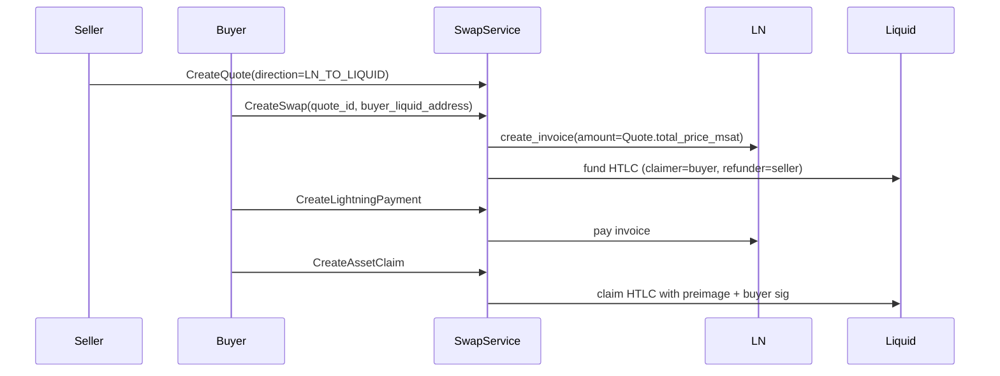
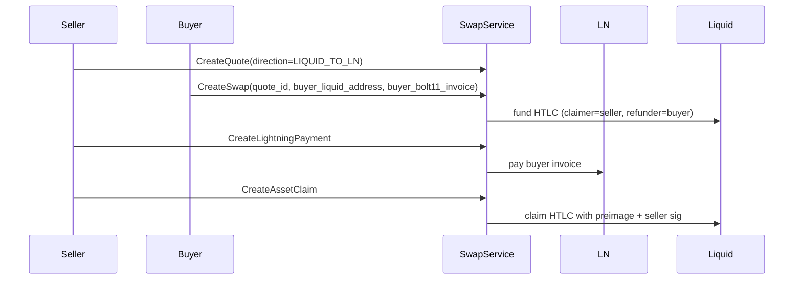

This document summarizes the protocol, roles, and end-to-end flows for the LN⇄Liquid swap
implementation in this repository.

## Security & Architectural Constraints

- The API MUST be accessed via gRPC only, and MUST NOT expose HTTP JSON endpoints.
  - Rationale: the schema is designed for gRPC and uses Protobuf validation rules.
- Clients MUST send `authorization: Bearer <token>` metadata for every RPC.
  - Rationale: the server enforces role-based authorization per swap.
- The service MUST run behind TLS or a private network boundary and MUST NOT be exposed publicly.
  - Rationale: bearer tokens are the only authentication mechanism in this minimal design.
- `buyer_liquid_address` MUST be a Liquid P2WPKH address on the same network as the wallet.
  - Rationale: the HTLC script uses hash160 of the P2WPKH pubkey hash.
- `buyer_bolt11_invoice` MUST be empty for `LN_TO_LIQUID` swaps.
  - Rationale: the server creates the invoice for the LN payee in that direction.
- `buyer_bolt11_invoice` MUST be present, must include an amount, and MUST NOT be expired for
  `LIQUID_TO_LN` swaps.
  - Rationale: the seller pays the buyer-provided invoice and must verify a fixed amount.
- The server MUST persist `Swap.direction` and MUST authorize `CreateLightningPayment` and
  `CreateAssetClaim` based on `Swap.parties`.
  - Rationale: execution roles are direction-dependent and must not be inferred from input.
- HTLC outputs MUST be explicit (unblinded) and MUST use a witness script that requires both
  preimage and signature for the claim path.
  - Rationale: this minimal design prioritizes clarity and prevents preimage-only theft.

## Concepts

- **Offer**
  - A server-side snapshot of price and policy (asset id, fee subsidy, refund delta).
  - Produced by `SwapServiceImpl::current_offer`.
- **Quote**
  - A pricing snapshot tied to `offer_id` and `direction`.
  - Stored in SQLite via `SqliteStore`.
- **Swap**
  - A persisted execution record bound to a quote, direction, invoice, and HTLC details.
  - Stored in SQLite via `SqliteStore`.
- **SwapDirection**
  - `LN_TO_LIQUID` (submarine) or `LIQUID_TO_LN` (reverse submarine).
- **SwapParties**
  - Role mapping derived from `Swap.direction` (ln_payer, ln_payee, liquid_funder,
    liquid_claimer, liquid_refunder).
- **Lightning invoice (BOLT11)**
  - Invoice paid by `Swap.parties.ln_payer`.
  - Payment hash must match the HTLC witness script.
- **Liquid HTLC**
  - A P2WSH output locking the asset and fee subsidy.
  - Witness script uses `claimer_pubkey_hash160` and `refunder_pubkey_hash160`.
- **Refund worker**
  - A background loop in `swap_server` that refunds expired swaps using `liquid_refunder` keys.

## Flows

### Role Mapping (by direction)

| Direction | ln_payer | ln_payee | liquid_funder | liquid_claimer | liquid_refunder |
| --- | --- | --- | --- | --- | --- |
| `LN_TO_LIQUID` | buyer | seller | seller | buyer | seller |
| `LIQUID_TO_LN` | seller | buyer | buyer | seller | buyer |

### LN_TO_LIQUID (Submarine Swap)

### LIQUID_TO_LN (Reverse Submarine Swap)

## Quality Gates

- `nix develop -c just ci` is the primary quality gate.
  - Includes format, lint, tests, textlint, docs lint, and broken-link checks.
- Ignored E2E tests exist for both directions and require regtest binaries.

## Where to Look in Code

- gRPC service logic: `src/swap/service.rs`
- SQLite persistence: `src/swap/store.rs`
- HTLC script and spend builders: `src/liquid/htlc.rs`
- LN client wrapper: `src/lightning/ldk.rs`
- Swap server binary and refund worker: `src/bin/swap_server.rs`
